# 🎯 Railway Deployment Visual Guide

## 📊 Deployment Flow Diagram

```mermaid
flowchart TD
    Start([Start Deployment]) --> A1{Code on<br/>GitHub?}
    
    A1 -->|No| B1[Step 1-5:<br/>Push to GitHub]
    A1 -->|Yes| C1[Step 6:<br/>Create Railway Project]
    B1 --> C1
    
    C1 --> D1[Step 7:<br/>Configure Backend Service]
    D1 --> D2[Set Service Name: backend<br/>Root Dir: server<br/>Build: npm install<br/>Start: npm start]
    
    D2 --> E1[Step 8:<br/>Set Backend Env Vars]
    E1 --> E2[PIXVERSE_API_KEY<br/>PORT=3001<br/>NODE_ENV=production]
    
    E2 --> F1[Step 9:<br/>Deploy Backend]
    F1 --> F2{Build<br/>Success?}
    
    F2 -->|No| F3[Check Logs<br/>Fix Errors]
    F3 --> F1
    F2 -->|Yes| G1[Step 10:<br/>Generate Domain<br/>Copy Backend URL]
    
    G1 --> H1[Step 11:<br/>Test Backend Health]
    H1 --> H2{Health Check<br/>OK?}
    
    H2 -->|No| H3[Debug Backend<br/>Check Logs]
    H3 --> F1
    H2 -->|Yes| I1[✅ Backend Ready!]
    
    I1 --> J1[Step 12:<br/>Add Frontend Service]
    J1 --> K1[Step 13:<br/>Configure Frontend]
    K1 --> K2[Service Name: frontend<br/>Root Dir: /<br/>Build: npm install && npm run build<br/>Start: npm run preview]
    
    K2 --> L1[Step 14:<br/>Set Frontend Env Vars]
    L1 --> L2[VITE_BACKEND_URL=backend-url<br/>VITE_SUPABASE_URL<br/>VITE_SUPABASE_ANON_KEY]
    
    L2 --> M1[Step 15:<br/>Deploy Frontend]
    M1 --> M2{Build<br/>Success?}
    
    M2 -->|No| M3[Check Logs<br/>Fix Errors]
    M3 --> M1
    M2 -->|Yes| N1[Step 16:<br/>Generate Domain<br/>Copy Frontend URL]
    
    N1 --> O1[Step 17-19:<br/>Test Full App]
    O1 --> O2{All Tests<br/>Pass?}
    
    O2 -->|No| O3[Step 20:<br/>Fix Issues]
    O3 --> O1
    O2 -->|Yes| P1[✅ Deployment Complete!]
    
    P1 --> Q1[Step 21-24:<br/>Post-Deployment]
    Q1 --> End([🎉 App Live!])
    
    style Start fill:#10b981,stroke:#059669,color:#fff
    style End fill:#10b981,stroke:#059669,color:#fff
    style I1 fill:#10b981,stroke:#059669,color:#fff
    style P1 fill:#10b981,stroke:#059669,color:#fff
    style F2 fill:#f59e0b,stroke:#d97706,color:#000
    style H2 fill:#f59e0b,stroke:#d97706,color:#000
    style M2 fill:#f59e0b,stroke:#d97706,color:#000
    style O2 fill:#f59e0b,stroke:#d97706,color:#000
    style F3 fill:#ef4444,stroke:#dc2626,color:#fff
    style H3 fill:#ef4444,stroke:#dc2626,color:#fff
    style M3 fill:#ef4444,stroke:#dc2626,color:#fff
    style O3 fill:#ef4444,stroke:#dc2626,color:#fff
```



---

## 🔢 Quick Step Numbers

| Phase | Steps | What You'll Do | Time |
|-------|-------|----------------|------|
| **Part 1: GitHub** | 1-5 | Push code to GitHub | 5 min |
| **Part 2: Backend** | 6-11 | Deploy & test backend | 5 min |
| **Part 3: Frontend** | 12-17 | Deploy & test frontend | 5 min |
| **Part 4: Testing** | 18-20 | Verify everything works | 3 min |
| **Part 5: Finish** | 21-24 | Post-deployment setup | 2 min |
| **Total** | **24 steps** | **Complete deployment** | **~20 min** |

---

## 📝 Simplified Checklist

### ✅ Part 1: GitHub (Steps 1-5)
```
□ Initialize Git
□ Add and commit files
□ Create GitHub repository
□ Push code to GitHub
```

### ✅ Part 2: Backend (Steps 6-11)
```
□ Create Railway project
□ Configure backend service (name, directory, commands)
□ Set environment variables (API key, port, node env)
□ Deploy backend
□ Generate domain
□ Test health endpoint
```

### ✅ Part 3: Frontend (Steps 12-17)
```
□ Add frontend service
□ Configure frontend service (name, directory, commands)
□ Set environment variables (backend URL, Supabase)
□ Deploy frontend
□ Generate domain
□ Test in browser
```

### ✅ Part 4: Testing (Steps 18-20)
```
□ Test homepage
□ Test photo upload
□ Test video generation
□ Test birthday stream
□ Check logs for errors
□ Fix any issues
```

### ✅ Part 5: Post-Deployment (Steps 21-24)
```
□ Document URLs
□ Set up custom domain (optional)
□ Verify auto-deploy
□ Set up monitoring
```

---

## 🎯 Critical Steps - Don't Skip!

> [!IMPORTANT]
> **Step 10**: Copy the backend URL - you MUST use this in Step 14!

> [!IMPORTANT]
> **Step 14**: Set `VITE_BACKEND_URL` to the exact backend URL from Step 10

> [!WARNING]
> **After Step 14**: If you change environment variables, you MUST redeploy the frontend!

> [!TIP]
> **Step 11 & 17**: Always test before moving to the next part!

---

## 🔍 What Each Part Does

### Part 1: GitHub Setup
**Purpose**: Get your code online so Railway can access it

**What happens**:
- Your code goes from local computer → GitHub
- Railway will pull code from GitHub to deploy

### Part 2: Backend Deployment
**Purpose**: Deploy the Express server that talks to Pixverse API

**What happens**:
- Railway creates a server
- Installs Node.js and dependencies
- Runs your Express server
- Gives you a public URL

### Part 3: Frontend Deployment
**Purpose**: Deploy the React app that users see

**What happens**:
- Railway creates another server
- Builds your React app
- Serves the built files
- Gives you a public URL

### Part 4: Testing
**Purpose**: Make sure everything works together

**What happens**:
- You test the full user flow
- Verify frontend can talk to backend
- Verify backend can talk to Pixverse
- Fix any issues

### Part 5: Post-Deployment
**Purpose**: Set up for long-term success

**What happens**:
- Document your deployment
- Set up auto-deploy
- Configure monitoring
- Optional: custom domain

---

## 🎬 Video Tutorial Outline

If you want to record yourself or follow along:

1. **[0:00-2:00]** Introduction & Prerequisites
2. **[2:00-5:00]** Part 1: Push to GitHub
3. **[5:00-10:00]** Part 2: Deploy Backend
4. **[10:00-15:00]** Part 3: Deploy Frontend
5. **[15:00-18:00]** Part 4: Testing
6. **[18:00-20:00]** Part 5: Post-Deployment
7. **[20:00-22:00]** Wrap-up & Next Steps

---

## 🆘 Quick Troubleshooting

| Problem | Step | Solution |
|---------|------|----------|
| Can't push to GitHub | 1-5 | Check Git credentials, create personal access token |
| Backend build fails | 9 | Check `server/package.json`, verify dependencies |
| Backend health fails | 11 | Check logs, verify `PIXVERSE_API_KEY` is set |
| Frontend build fails | 15 | Check `package.json`, verify all env vars set |
| Frontend can't reach backend | 17 | Verify `VITE_BACKEND_URL` matches Step 10 URL |
| CORS errors | 18 | Update `server/index.js` CORS settings |
| Video generation fails | 18 | Check backend logs, verify Pixverse API key |

---

## 📱 Mobile-Friendly Checklist

Save this on your phone while deploying:

```
✅ GITHUB
□ Code pushed

✅ BACKEND
□ Service created
□ Configured (server/, npm install, npm start)
□ Env vars set (API key, port, node env)
□ Deployed
□ Domain generated
□ Health tested
□ URL saved: _______________

✅ FRONTEND
□ Service created
□ Configured (/, build, preview)
□ Env vars set (backend URL, Supabase)
□ Deployed
□ Domain generated
□ App tested

✅ DONE!
□ URLs documented
□ Auto-deploy verified
□ Monitoring set up
```

---

## 🎓 Learning Resources

After deployment, learn more:

- **Railway Docs**: https://docs.railway.app
- **Vite Docs**: https://vitejs.dev
- **Express Docs**: https://expressjs.com
- **Railway Discord**: https://discord.gg/railway

---

**Ready to deploy? Open [STEP_BY_STEP_DEPLOYMENT.md](./STEP_BY_STEP_DEPLOYMENT.md) and let's go! 🚀**
