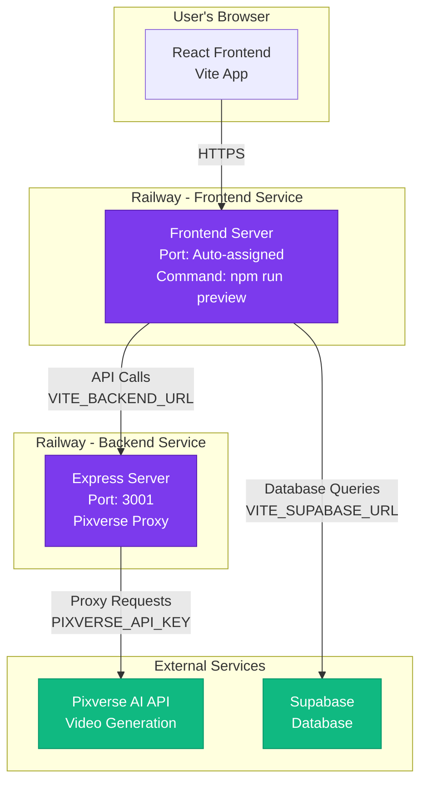
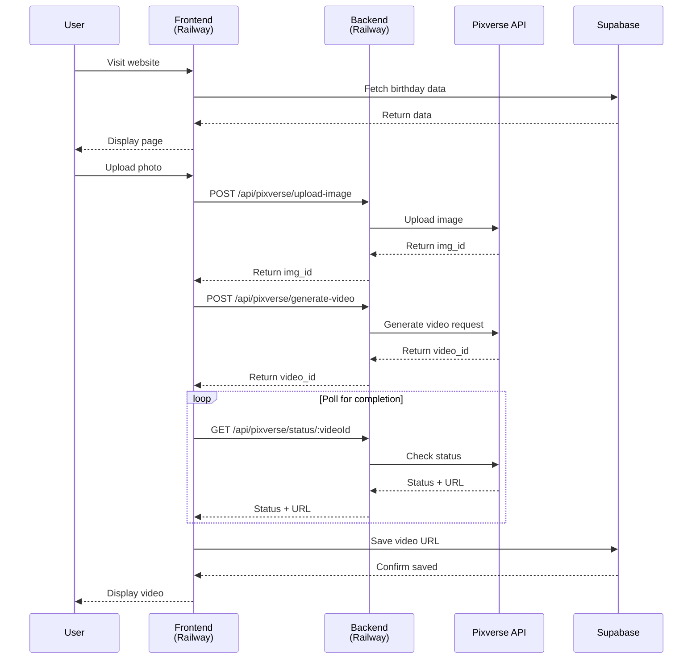
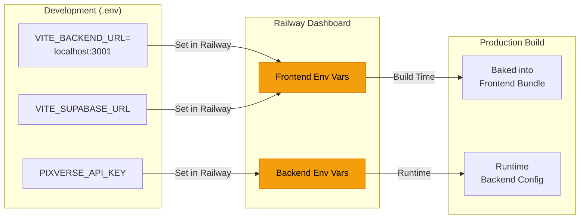
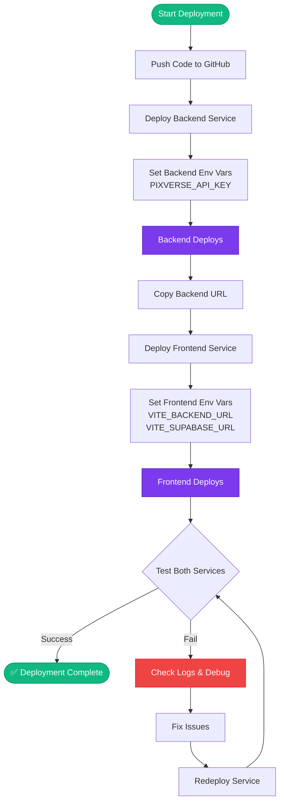
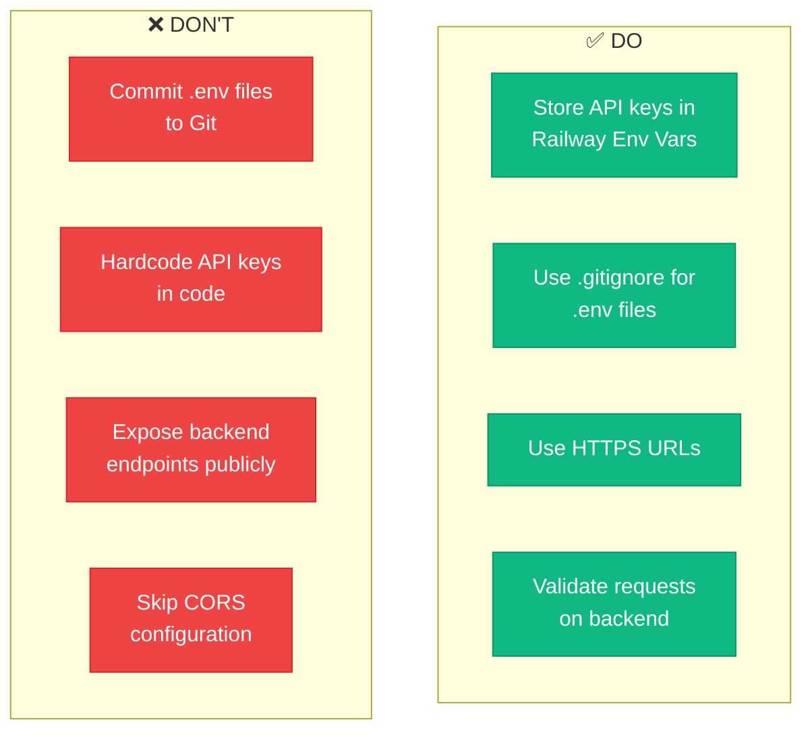
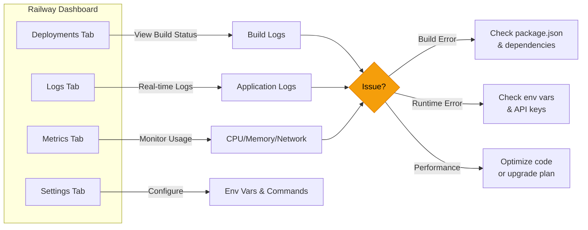

# Railway Deployment Architecture

## 🏗️ Architecture Overview



## 📦 Service Configuration

### Frontend Service
```
┌─────────────────────────────────┐
│  Railway Frontend Service       │
├─────────────────────────────────┤
│ Root Directory: /               │
│ Build: npm install && npm build │
│ Start: npm run preview          │
│ Port: $PORT (auto-assigned)     │
├─────────────────────────────────┤
│ Environment Variables:          │
│ • VITE_BACKEND_URL             │
│ • VITE_SUPABASE_URL            │
│ • VITE_SUPABASE_ANON_KEY       │
└─────────────────────────────────┘
```

### Backend Service
```
┌─────────────────────────────────┐
│  Railway Backend Service        │
├─────────────────────────────────┤
│ Root Directory: server/         │
│ Build: npm install              │
│ Start: npm start                │
│ Port: 3001                      │
├─────────────────────────────────┤
│ Environment Variables:          │
│ • PIXVERSE_API_KEY             │
│ • PORT                         │
│ • NODE_ENV                     │
└─────────────────────────────────┘
```

## 🔄 Request Flow



## 🌐 Environment Variables Flow



## 📊 Deployment Steps Visualization



## 🔐 Security Best Practices



## 📈 Monitoring & Debugging



## 🎯 Key Points

1. **Two Separate Services**: Frontend and Backend are deployed as independent services
2. **Environment Variables**: Frontend vars are baked into build, Backend vars are runtime
3. **URL Configuration**: Backend URL must be set in Frontend env vars
4. **Auto-Deploy**: Railway auto-deploys on Git push (can be disabled)
5. **Logs**: Always check logs for debugging deployment issues

---

For detailed step-by-step instructions, see:
- [Railway Quick Start](./RAILWAY_QUICKSTART.md)
- [Full Deployment Guide](./RAILWAY_DEPLOYMENT_GUIDE.md)
